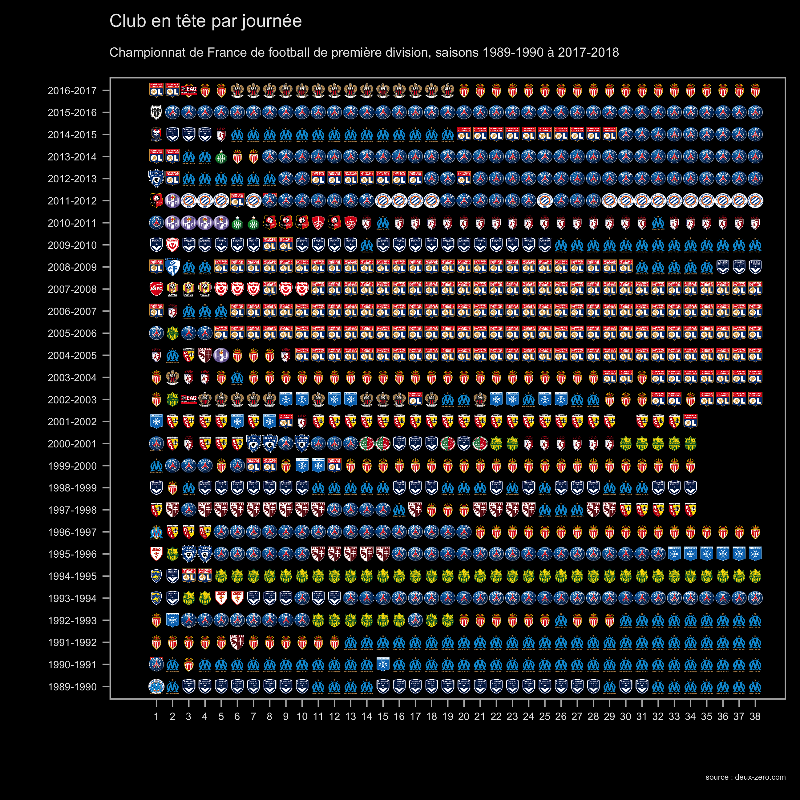
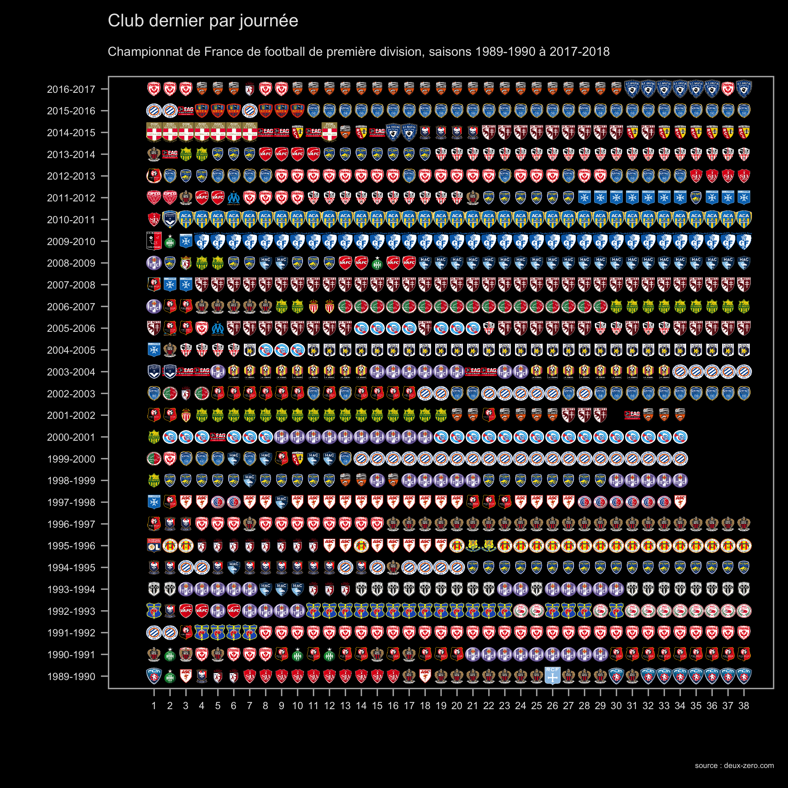

---
output:
   html_document:
      self_contained: false
      keep_md: true
---
 
```{r setup, include=FALSE}
knitr::opts_chunk$set(echo = TRUE)
library(data.table)
library(tidyverse)
histo_classements <- fread("./data/df_histo_classements.csv")

library(knitr)
library(directlabels)
library(hrbrthemes)
library(viridis)
library(forcats)
library(magrittr)
library(ggimage)


```

La revue des Cahiers du Football, numéro 1 [disponible en abonnement et en librairie](http://www.cahiersdufootball.net/article-la-revue-numero-1-6964) !

```{r, out.width = "50%", echo=F, message=F}
include_graphics("http://www.cahiersdufootball.net/images-article/images2/2018_05/numero-1-couv-double-2-480.jpg")
```


Trois infographies à retrouver ici (dont la première en version interactive)

```{r position_club_journee, echo=F, message=F, warning=F,fig.width=12,fig.height=9}


# calcul position totale ####
position_clubs_globale <-
histo_classements %>% 
  #filter(!saison %in% '2017-2018' ) %>%
  mutate(saison_J = paste0(saison,"_",journee)) %>%
  expand(nom_club_actuel,saison_J) %>%
  left_join(histo_classements %>% 
              filter(!saison %in% '2017-2018' ) %>%
              mutate(saison_J = paste0(saison,"_",journee)) %>%
              select(nom_club_actuel, saison_J,position.dedup ) , by = c("nom_club_actuel", "saison_J")) %>%
  #position 30 si pas en D1
  mutate(position.dedup = ifelse(is.na(position.dedup), 30, as.numeric(position.dedup))) %>%
  
  # position moyenne sur toute la période
  group_by(nom_club_actuel) %>%
  summarise(position.dedup.moy = mean(position.dedup)) %>%
  arrange(position.dedup.moy ) %>%
  mutate(position.dedup.rang = row_number())


library(ggiraph)
ggi <-
ggplot() +
  geom_point_interactive(data = histo_classements %>%
                           mutate(saison_j = paste0(saison, "_",journee), id = row_number(),
                                  position.dedup.s = case_when(position.dedup == 1 ~ "1er", TRUE ~ paste0(position.dedup,"ème"))) %>%
               #filter(saison %in% '2017-2018' & journee <= 20|!saison %in% '2017-2018' ) %>%
               #filter(!saison %in% '2017-2018' ) %>%
               left_join(position_clubs_globale, by = "nom_club_actuel"),# %>% filter(!saison %in% '2017-2018'),
             aes(x= saison_j, y =fct_reorder(nom_club_actuel,-position.dedup.moy)  , color = position.dedup,
                 tooltip = paste("<strong>", nom_club_actuel,"</strong><br />", 
                                 saison,", J",journee, " : ",position.dedup.s,"<br />"),
                 data_id = id), shape ='|') +
  # geom_text(data = affluence_club_oppositions %>% filter(nb_matchs > 5),
  #            aes(x= reorder(club_visiteur_actuel, affluence.visiteur), y =reorder(club_domicile_actuel, affluence.domicile), label = percent(tx_remplissage %>% round(2)) ,size =affluence), color ="grey") +
  #scale_fill_brewer( palette = "RdBu", direction = 1, name = 'Taux de\remplissage') +
  scale_color_viridis(option="magma", direction = -1,  name = 'Position',guide=guide_colorbar(reverse = TRUE)) +
  scale_x_discrete(name = "saison et journée") +
  scale_y_discrete(name = "") +
  theme_light() +
  theme(panel.background = element_rect(fill = "black",  colour = NA),
        panel.grid = element_line(colour = "black"),
        plot.background = element_rect(fill='black',colour='black'),
        axis.text.y = element_text(size = 4, color = "grey90"),axis.text.x = element_blank(),
        plot.title = element_text(size = 7,color = "grey90"),
        plot.subtitle =element_text(size = 5,color = "grey90"),
        plot.caption =element_text(size = 3,color = "grey90"),
        legend.title = element_text(size = 4,color = "white"),
        legend.background = element_rect(fill="black"),
        legend.text = element_text(size = 3,color = "white")) +
  labs(title="Position au classement par saison et journée",
       subtitle="Championnat de France de football de première division, saisons 1989-1990 à 2017-2018",
       caption="source : deux-zero.com") 

# style du popup
tooltip_css <- "background-color:white;padding:2px;font-size: 80%;color: white;opacity:0.2"


# ggiraph
  ggiraph(code = {print(ggi)},
          #selection_type = "multiple", 
          # height_svg = 50, 
          #  width_svg = 50,
          width = 1,
          #height = 8,
          #tooltip_extra_css = tooltip_css,
          #tooltip_offx = -40, tooltip_offy = -30,
          zoom_max = 1,
          #hover_css = "{fill:red;r:16px;}",
          hover_css = "fill:red;r:10pt;")


```


<br>
<br>

```{r graphique_premier,echo=F, message=F, warning=F,fig.width=6,fig.height=6 , eval = FALSE}

# image logo club leader par journée ####

ggplot() +
  geom_image(data = histo_classements %>%
               mutate(saison_j = paste0(saison, "_",journee)) %>%
             #filter(saison %in% c('1997-1998','1998-1999','2008-2009') ) %>%
              # filter(saison %in% '2017-2018' & journee <= 20|!saison %in% '2017-2018' ) %>%
             # filter(position ==1),
             filter(position.dedup == min(position.dedup)) ,
             aes(x= journee, y =saison , image = logo_png, size = journee)) +
  scale_color_manual(values = colorRampPalette(brewer.pal(8, "Accent"))(29)) +
  #scale_y_discrete(name = "saison",limits = paste0(seq(1989,2017,1),"-",seq(1990,2018,1))) +
  scale_y_discrete(name = "saison",limits = paste0(seq(1989,2016,1),"-",seq(1990,2017,1))) +
  scale_x_continuous(name = "journee", limits = c(0,38), breaks = seq(1,38,1)) +
  scale_size_continuous(range =c(0.024,0.024), trans ="log" , guide =F) +
    theme_light() +
  theme(panel.background = element_rect(fill = "black",  colour = NA),
        panel.grid = element_line(colour = "black"),
        plot.background = element_rect(fill='black',colour='black'),
        axis.text.y = element_text(size = 4, color = "grey90"),axis.text.x = element_blank(),
        plot.title = element_text(size = 7,color = "grey90"),
        plot.subtitle =element_text(size = 5,color = "grey90"),
        plot.caption =element_text(size = 3,color = "grey90"),
        legend.title = element_text(size = 4,color = "white"),
        legend.background = element_rect(fill="black"),
        legend.text = element_text(size = 3,color = "white")) +
  labs(title="Club en tête par journée",
       subtitle="Championnat de France de football de première division, saisons 1989-1990 à 2017-2018",
       caption="source : deux-zero.com") 
```




<br>
<br>


```{r graphique_dernier,echo=F, message=F, warning=F,fig.width=6,fig.height=6 , eval = FALSE}

# image logo club dernier par journée ####

ggplot() +
  geom_image(data = histo_classements %>%
               group_by(saison, journee) %>%
               filter(position.dedup == max(position.dedup)) ,
             aes(x= journee, y =saison , image = logo_png, size = journee)) +
  scale_color_manual(values = colorRampPalette(brewer.pal(8, "Accent"))(29)) +
  #scale_y_discrete(name = "saison",limits = paste0(seq(1989,2017,1),"-",seq(1990,2018,1))) +
  scale_y_discrete(name = "saison",limits = paste0(seq(1989,2016,1),"-",seq(1990,2017,1))) +
  scale_x_continuous(name = "journee", limits = c(0,38), breaks = seq(1,38,1)) +
  scale_size_continuous(range =c(0.024,0.024), trans ="log" , guide =F) +
  theme_light() +
  theme(panel.background = element_rect(fill = "black",  colour = NA),
        panel.grid = element_line(colour = "black"),
        plot.background = element_rect(fill='black',colour='black'),
        axis.text = element_text(size = 4, color = "grey90"),
        plot.title = element_text(size = 7,color = "grey90"),
        plot.subtitle =element_text(size = 5,color = "grey90"),
        plot.caption =element_text(size = 3,color = "grey90"),
        legend.title = element_text(size = 4,color = "white"),
        legend.background = element_rect(fill="black"),
        legend.text = element_text(size = 3,color = "white")) +
  labs(title="Club dernier par journée",
       subtitle="Championnat de France de football de première division, saisons 1989-1990 à 2017-2018",
       caption="source : deux-zero.com") 


```


