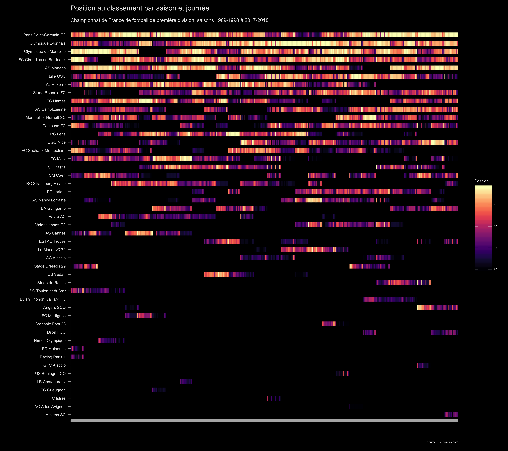

```{r setup, include=FALSE}
knitr::opts_chunk$set(echo = TRUE)
library(data.table)
library(tidyverse)
histo_classements <- fread("./data/df_histo_classements.csv")

library(knitr)
library(directlabels)
library(hrbrthemes)
library(viridis)
library(forcats)
library(magrittr)
library(ggimage)


```

La revue des Cahiers du Football, numéro 1 [disponible en abonnement et en librairie](http://www.cahiersdufootball.net/article-la-revue-numero-1-6964) !

```{r, out.width = "50%", echo=F, message=F}
include_graphics("http://www.cahiersdufootball.net/images-article/images2/2018_05/numero-1-couv-double-2-480.jpg")
```


Trois infographies à retrouver ici avec les scripts R associés.


<br>
<br>



<br>
<br>


<br>
<br>


